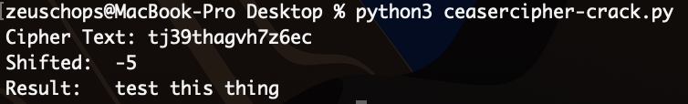

# ceaser cipher
Quick project that makes working with ceaser ciphered strings easy to work with.

## words.txt
Words.txt has been pulled from MacOS to reuse it with other OSes without issues. The location of the dictionary file was found at /usr/share/dict/words.

## Example
Start the script with `python3 ceasercipher-crack.py` and then copy and paste your word/phrase into the prompt and let the software do the rest. (See sample image below.)

